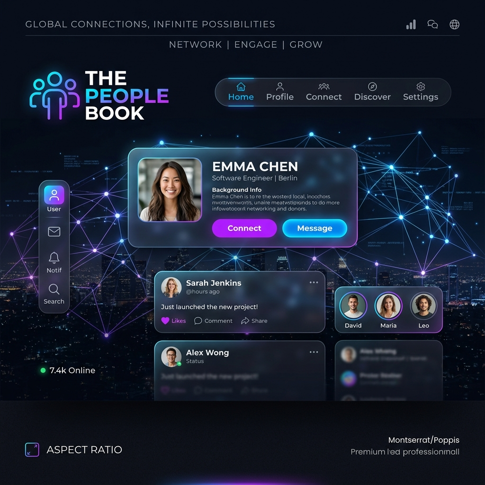

# The People Book

<div align="center">
  
  
  <p align="center">
    <strong>A privacy-first, full-stack social ecosystem with glassmorphic aesthetics.</strong>
  </p>

[](https://opensource.org/licenses/MIT)
[](https://nodejs.org/)
[](https://www.prisma.io/)
[](https://reactjs.org/)
[](https://www.postgresql.org/)

</div>

---

## 🌟 Overview

**The People Book** is a cutting-edge social networking platform built for the modern web. It combines a premium, glassmorphic UI with a high-performance, type-safe backend to deliver a seamless user experience.

### 🎥 Watch the Demo

[](https://youtu.be/Li9VcNrbDqY)

---

## ✨ Features

### 📬 Social Core

- **Infinite Feed**: High-performance virtualized scrolling for an endless content stream.
- **Rich Interactions**: Nested comments with replies, likes, and a repost system.
- **Stories**: Dynamic 24-hour disappearing media updates.
- **Groups**: Comprehensive community management for public and private circles.

### ⚡ Real-Time Engine

- **Instant Messaging**: Low-latency, peer-to-peer chat powered by Socket.IO.
- **Live Notifications**: Real-time alerts for all social interactions.
- **Smart Push**: Cross-platform engagement via Web Push notifications.

### 🛡️ Security & Privacy

- **Enterprise Auth**: JWT-based authentication with HttpOnly cookies and token rotation.
- **DSA Compliance**: Integrated moderation tools, reporting, and appeal workflows.
- **Data Sovereignty**: GDPR-compliant data export and permanent account deletion.

---

## 🛠️ Technology Stack

| Layer              | Technologies                                             |
| ------------------ | -------------------------------------------------------- |
| **Frontend**       | React 18, Vite, TanStack Query, Zustand, Framer Motion   |
| **Backend**        | Node.js, Express, Socket.IO, Prisma ORM                  |
| **Database**       | PostgreSQL (with Driver Adapter), Redis (Caching/Queues) |
| **Storage**        | AWS S3 Compatible Media Hosting                          |
| **Infrastructure** | Docker, Nginx, Sentry (Error Tracking)                   |

---

## 🚀 Quick Start (Local Development)

### Prerequisites

- Node.js 20+
- PostgreSQL 14+

### 1. Backend Setup

```bash
cd backend
cp .env.example .env  # Configure your DATABASE_URL and secrets
npm install
npx prisma db push    # Sync the schema to your local DB
npm run dev
```

### 2. Frontend Setup

```bash
cd ../frontend
npm install
npm run dev
```

---

## 🏗️ Project Structure

```bash
social/
├── backend/
│   ├── src/
│   │   ├── config/      # Prisma, Passport, Redis configs
│   │   ├── controllers/ # Business logic (100% Prisma migrated)
│   │   ├── models/      # Complex SQL fragments & utility queries
│   │   └── services/    # Socket.IO & Push Notification logic
│   └── prisma/          # Schema definition & migrations
└── frontend/
    └── src/
        ├── components/  # Reusable UI (Glassmorphic design system)
        ├── store/       # Zustand Global State
        └── services/    # API & WebSocket client
```

---

## 🤝 Contributing

Contributions are welcome! Whether it's a bug report, feature request, or a full pull request, we appreciate your help in making **The People Book** better.

### License

This project is licensed under the [MIT License](LICENSE).
